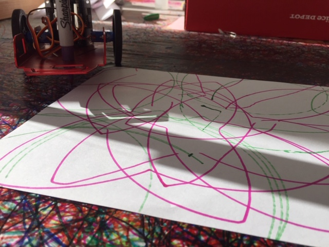
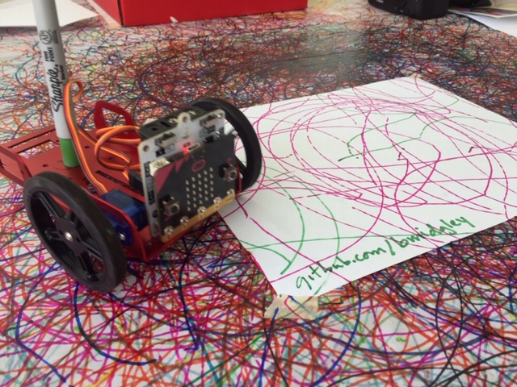

# festivalbot
Utah Arts Festival 2019 Draw Bot

Built using:

* two microbit boards; one controller you hold and tilt and the other in the car
* elecfreaks.com servo driver board (probably also runs ring:bit car)
* Feetech FT-MC-003 4WD Mini Mobile Robotics Platform Kit (bed only)
* Feetech FS90R 360 Degree Continuous Rotation Micro Servo Motor + RC Tire Wheel (two)

Drill a hole in the center back of the sled to hold a sharpie.

